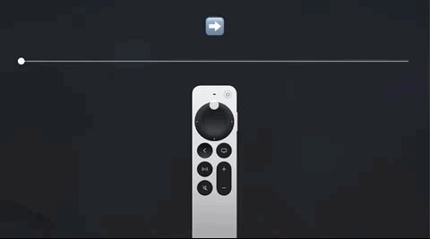

# tvOS-clickWheelGestures

This is an playground project to show how to capture Click Wheel gestures from Siri Remote 2nd generation

You can find all the details in the [blog post](https://dcordero.me/posts/capture_circular_gestures_on_siri_remote_2nd_generation.html)
